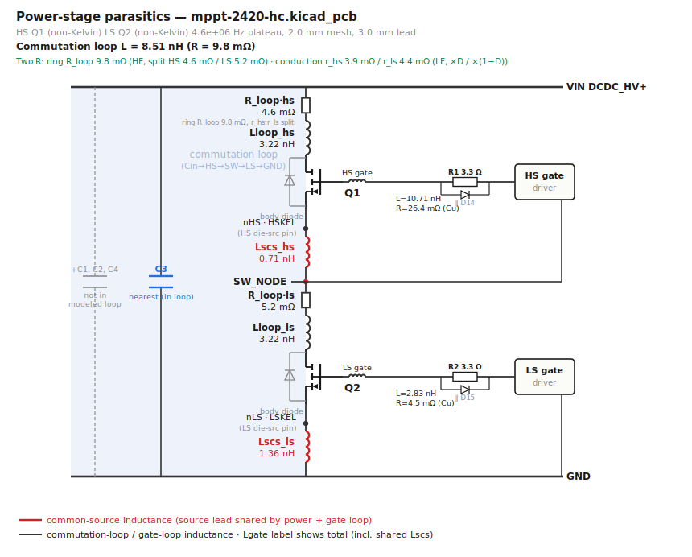

# parasitics — KiCad → FastHenry power-stage extractor

Extracts the half-bridge power-stage parasitic inductances and resistances
from a KiCad PCB for:

1. **Switch-node ringing** — the commutation-loop inductance that,
   with the FET Coss and Qrr, sets the SW overshoot and ring frequency.
2. **Gate-drive analysis** — compute gate-loop inductance and detect ringing
   issues. The gate loop overlaps the high-di/dt commutation path through the
   FET **source lead**, so that shared **common-source inductance (CSI)** feeds
   power di/dt back into the gate drive.
3. **Power-loss / efficiency modelling** — the extracted **resistances** are the
   copper contribution to the I²R budget, split **per switch** so
   the conduction loss can be weighted by each switch's duty (HS by D, LS by 1−D —
   the LS copper dominates at low duty). The loop carries current at two very
   different frequencies (switching frequency and HF ringing), so it has [two
   resistances](#two-resistances-hf-ring-vs-lf-conduction).

You give it the **switch-node net** and the **GND net**; everything else (HS/LS
FETs, Vin rail, gate nets, input caps) is auto-discovered from connectivity, with
overrides for every guess.

## Showcase

Half-bridge parasitics extracted from the open-hardware
[LibreSolar MPPT 2420 HC](https://github.com/LibreSolar/mppt-2420-hc) (4-layer
synchronous buck), rendered by `--svg`: each parasitic as a labelled coil, the
two **common-source source-leads in red**, the input-cap bank (the ported cap and
the greyed-out ones), and the auto-detected gate network (Rg). This is the
historical lead-inclusive fixture and is retained as an output-format showcase;
its numeric labels are not a current copper-only validation.



## How it works

Each extraction basis uses one FastHenry solve with multiple ports to obtain its
full mutual-inductance matrix. The baseline/full-loop extraction and the
`lead_mm=0` identity-matrix path need one solve. A non-identity matrix Cin request
may run three matched bases (`full_loop`, `cap_only`, and `switch_residual`) so
the producer can separate cap-side and switch-side copper without mixing gauges.

| Port | Across | Gives |
|------|--------|-------|
| `P_pwr` | nearest Cin — **MLCC** (Vin ↔ GND) | commutation-loop L, HF ring R |
| `P_ghs` | HS gate driver-end ↔ HS gate return | HS gate-loop L |
| `P_gls` | LS gate driver-end ↔ LS gate return | LS gate-loop L |
| `P_bulk` | nearest **bulk electrolytic** (Vin ↔ GND) | LF conduction-loop R |
| `P_hs` | Vin(bulk) → SW, via HS leads | HS conduction R |
| `P_ls` | SW → GND(bulk), via LS leads | LS conduction R |

In the full-loop basis, both FET channels are shorted at the die plane
(`.equiv drain_die source_die`)
and each gate is closed to its source there, so `P_pwr` traces the full
`Cin → HS → SW → LS → GND → Cin` shoot-through loop and each gate loop shares that
FET's source lead. **CSI then falls out as the side-specific mutual**
`M(P_hs, P_ghs)` / `M(P_ls, P_gls)` — the shared source-lead partial inductance
that the gate driver actually sees. The older full-loop mutual is still recorded
as `csi_hs_loop` / `csi_ls_loop` in JSON for diagnostics. Whether the gate return
taps the die-source (**Kelvin**, CSI excluded) or the power-source pad
(**non-Kelvin**, full CSI) is encoded by where the gate-return node is placed
(default: non-Kelvin / worst case; force with `--hs-kelvin` / `--ls-kelvin`).

### Parallel input caps (`--cin-parallel N`)

By default `P_pwr` sits across the **single nearest** ceramic — a *conservative
upper bound* on the loop L, because it ignores the other input caps that share the
commutation current. Since inductances in parallel combine reciprocally, the real
effective loop L is **lower**, so the single-cap number over-estimates SW-node
overshoot. `--cin-parallel N` ports the **N nearest** input ceramics in the same
solve, so FastHenry returns their full mutual matrix, and the reduce step forms the
true effective 2-terminal commutation impedance under a common-voltage drive
(every cap pad pair at the same SW-node voltage, gates open):

```
Z_eff = 1 / (1ᵀ Zc⁻¹ 1)          (Zc = N×N cap-port submatrix)
```

which folds in every branch-to-branch mutual `Mᵢⱼ` exactly (not a naive `1/ΣLᵢ`),
solved as `Zc x = 1` (never an explicit inverse; `cond(Zc)` is reported and a
warning fires if it is ill-conditioned). The parallel-cap current split
`y = Zc⁻¹·1` is reported per refdes.

**The SW-peak loop L is a bracket, not one number:**

| bound | meaning |
|---|---|
| `L_loop_single` (upper) | nearest single cap alone — pessimistic |
| `L_loop_ideal` (lower) | all N caps ‖, treated as ideal shorts (copper only) |
| `L_loop_physical` | plateau-band result with the uniform per-cap series ESL/ESR supplied by `--cin-esl`/`--cin-esr` |

The truth sits between the bounds, near the lower one when cap ESL ≪ per-cap branch
L. `L_loop_physical` and the top-level `current_split` are evaluated at the selected
L plateau (default 5 MHz), not at `--ring-freq`. The reducer applies the same series
ESL/ESR at every point in `L_eff_sweep`, so that array contains the full effective
loop L/R sweep, including the point nearest the ring. It does not currently emit a
per-cap ring-frequency current split. The series-only cap term is a useful
above-SRF diagnostic; it is not a full C/ESR/ESL capacitor model. The loss tool
supplies that full model from dslib.

Without `--cin-esl`/`--cin-esr` the headline remains the ideal-cap copper lower
bound. The two bounds always land in the report/JSON; `L_loop_physical` is set
only when a series ESL or ESR was supplied. Port polarity is fixed (always
Vin→GND) so a reversed cap cannot silently corrupt the mutuals; a spuriously-low
effective L still trips a warning.

**Cap selection.** Default is nearest-by-centroid-distance (deterministic, shown in
the manifest as `cin_select`); **bulk electrolytics are excluded by package/type**
(THT can/radial, `CP_`/`Elec`/tantalum/polymer footprints) — above their SRF they
can't source the tens-of-MHz edge. Classification is **by footprint, not value**, so
a 10–22 µF 1210 MLCC stays in the HF set while a small electrolytic stays out; the
per-refdes class is recorded in `cin_class`. Keep the bulk caps with
`--include-bulk-cin` (e.g. a low-frequency ripple-path study). Override selection
entirely with `--cin-loop-refs C17 C18 C9 C16`. If you request more caps than
exist, it warns and solves with what it found rather than silently clamping.

### Two resistances: HF ring vs LF conduction

The loop resistance is **not one number**, because it carries current at two
frequencies that see different copper and different reference caps:

| R | Freq | Anchored on | Used for |
|---|---|---|---|
| `R_loop` (ring) | ~MHz plateau | nearest **MLCC** (sources the edge) | SW-node ring Q / damping; skin-elevated |
| `R_hs` / `R_ls` (conduction) | ~DC fundamental | nearest **bulk electrolytic** | conduction I²R, split per switch |

At the 39 kHz switching fundamental the **MLCCs are ~open** and carry no conduction
current — the fundamental is sourced and returned by the **bulk electrolytics**. So
the conduction ports (`P_hs`/`P_ls`/`P_bulk`) anchor on the nearest bulk cap, not the
ceramic, and their R is read at the **lowest swept frequency** (skin depth ≫ copper
thickness there, i.e. the near-DC conduction value) rather than at the ring plateau.
`P_hs` drives Vin(bulk) → SW through the HS drain+source leads (the die short routes
it), so its self-R is that switch's true conduction copper; `P_ls` likewise for
SW → GND. The residual `R_loop_cond − R_hs − R_ls` is reported as the **SW-node
spreading R**. In the emitted `.SUBCKT`, `R_loop` is a single solved HF ring
resistance; its HS/LS `Rser` placement is only a damping distribution, split by
the LF `R_hs:R_ls` proportion. A reconstruction check warns if the per-side
conduction R exceeds the LF loop R (a port-polarity/SW-reference tripwire).
Boards with an **all-ceramic** input bank fall back to the nearest ceramic for the
conduction anchor (there the ceramics *do* carry the fundamental); the anchor
refdes and class are recorded in `cond_ref`.

Both `R_loop` and `R_hs`/`R_ls` are read at a single characteristic frequency (the ring
plateau and near-DC respectively). To get the **AC resistance at an arbitrary
frequency**, raise the skin sub-mesh (`--nwinc/--nhinc > 1`); the per-frequency
`L_eff_sweep` in the JSON then shows R rising across the band as skin/proximity effect
crowds the current.

#### Not two resistances — a curve (`cin_skin`)

"Ring plateau" was itself a compromise: the plateau is read at ~5 MHz, roughly a decade
**below** the band the SW ring actually decays in. Measured on Fugu2:

| band | loop R | vs the exported plateau |
|---|---|---|
| 39 kHz (f<sub>sw</sub>) | 1.41 mΩ | 0.45× |
| 3.9 MHz (exported `R_loop`) | 3.13 mΩ | 1.00× |
| **39 MHz (SW ring)** | **5.34 mΩ** | **1.70×** |
| 84 MHz | 5.48 mΩ | 1.75× — saturated |

The rise is **sub-√f and saturates** above ~20 MHz: once the skin depth falls below the
35 µm foil the current is already confined, so the textbook √f law over-predicts it. `L_loop`
is flat over the same span (3.20 → 3.16 nH) — only R moves.

A consumer that places a single R therefore damps its ring with the wrong number (the loss
deck was **−71 %** on the loop R at the ring). So the reduction also fits a series **Foster RL
ladder** to the swept solve and exports it as `cin_skin`: a set of (Rₖ, Lₖ) poles that add 0 Ω at
DC and Σ Rₖ at the ring. Consumers place it in series with the commutation leg on top of the
**DC-band** branch R (`cin_matrix.R_dc`) and get the whole curve, not two points. On Fugu2 five
poles track R(f) to 1.2 % from 39 kHz to 84 MHz.

The corners are FIXED (log-spaced) and only the pole resistances are solved, by **NNLS** — so the
fit is deterministic and Rₖ ≥ 0 by construction (a negative pole would be an *active* element).
`--ring-freq` sets the band it must be honest at (default 55 MHz) and `--skin-poles` the pole
count. The ladder is currently emitted only for a valid identity-basis matrix Cin
model (`--emit-cin-network --cin-network-model matrix` with pad-ideal
`--lead-mm 0` extraction). If the selected Cin basis cannot carry the fit, or if
the sweep (`--hf-freq`) never reaches the ring band, **no ladder is emitted** and
`cin_skin_unavailable_reason` says why. The rise is not extrapolated, and "no
ladder" must never be read as "copper is flat".

### Input-cap network (`--emit-cin-network`)

For the loss tool's **Cin ESR / input-ripple** model, `--emit-cin-network` ports the
**full input bank** (bulk + MLCC) individually (`P_cin_<ref>`, separate from the
MLCC-only HF-loop selection so `L_loop` is untouched). `--cin-loop-refs` selects
the caps used for the headline commutation-loop reduction;
`--cin-network-refs` independently restricts the full-bank network. The deprecated
`--cin-refs` spelling is only an alias for `--cin-loop-refs`.

Choose the copper model explicitly:

| requested model | behavior | intended use |
|---|---|---|
| `--cin-network-model matrix` | Preserves the full coupled-L cap-port matrix and may resolve to `cin_model.mode=matrix` or `matrix_with_sw_coupling`. With `lead_mm=0`, the accepted identity basis keeps all switch-side board-copper L in the matrix and emits `L_sw_element=0` by construction. | Production loss flow; required for heterogeneous banks such as the complete seven-cap Fugu2 bank. |
| `--cin-network-model scalar_trunk` | Legacy reduction to one shared Vin/GND trunk plus one private branch per cap: `L[i,i] = L_shared + Lb_i`, `L[i,j] ≈ L_shared`. | Compatibility and homogeneous-bank diagnostics only. |

The scalar reduction emits `cin_branches` and
`cin_L_shared`/`cin_R_shared`; its `_raw` counterparts preserve the unclamped
diagnostic decomposition. This topology cannot represent every passive coupled
matrix. The extractor therefore validates it and fails closed when it is invalid.
`--allow-scalar-cin` is an expert override that emits the legacy clamped model; it
does not make the approximation accurate. Consumers must dispatch on
`cin_model.mode` and `cin_model_valid`, not blindly consume the scalar fields.

Matrix mode emits `cin_matrix`, including its `basis`, cap refs, coupled L matrix,
`R_100k`, `R_dc`, realizability metadata, switch-copper ownership, and any resolved
switch coupling. The loss tool normally assembles the Cin SPICE text in memory and
includes the model/provenance header. If that text is instead supplied through a
persisted `cin_network.lib`, the reader uses its header to refuse stale, invalid,
or undispatchable networks; the extractor itself does not write this `.lib`.

Both models are **copper only** — parasitics stays parts-DB-free. The loss tool
enriches each `ref` with its datasheet C/ESR/ESL from dslib and builds the complete
`cin_network`. Copper branch resistance is distinct from dielectric ESR. In
matrix mode, `R_dc` supplies the base/conduction band and `cin_skin` adds the
frequency-dependent rise without double-counting switch-path resistance.

Meshing: tracks → filaments; copper pours → a gridded filament mesh clipped to the
real filled polygon (and to an ROI around the FETs/Cin, so far copper is skipped);
vias → vertical filaments; THT pads and FET leads → vertical stubs to a die plane.
Track widths come from KiCad; segment height is `--cu-thickness` (default 0.035 mm).
Nodes are interned by `(net, layer, snapped-xy)` so coincident same-net endpoints
merge, and every track/via/pad node is bonded to its pour (fixes fragmented
copper); a union-find prune keeps only port-reachable copper. `L = Im(Z)/2πf`,
`R = Re(Z)` read at a low-MHz plateau.

FET package inductance has a strict modeling boundary with the loss tool and
MOSFET SPICE models. The legacy `--lead-mm` path is an artificial die-plane
extension, not a physical bent-lead package model; use copper-only extraction for
loss when the MOSFET model already carries package leads. See
[docs/fet-package-boundary.md](docs/fet-package-boundary.md) for the full contract.

## Usage

```sh
python3 extract_parasitics.py PCB --sw SW_NET --gnd GND_NET \
        [--pitch 2.0 1.0] [--lead-mm 0] [--cu-thickness 0.035] [--lf-freq 1e3] [--vin NET] \
        [--cin-parallel 4 | --cin-loop-refs C17 C18 C9 C16] [--include-bulk-cin] \
        [--cin-network-refs C17 C18 C9 C16] \
        [--cin-esl 0.5 --cin-esr 3] \
        [--emit-cin-network --cin-network-model matrix|scalar_trunk] \
        [--hs-ref Q1 Q3 --ls-ref Q2] [--hs-gate NET --ls-gate NET] \
        [--parallel-fets lumped|per-device] \
        [--hs-kelvin] [--ls-kelvin] [--weld-tol 0.6] [--zone-mesh grid|polygon] \
        [--terminal-mode padland|single|finite|point] \
        [--margin 8] [--svg] -o OUTDIR
```

The historical CLI defaults are `lead_mm=3`, `parallel_fets=lumped`, and
`cin_network_model=scalar_trunk`. They remain for artifact compatibility, not as
the recommended loss-flow combination. Set the package boundary and Cin model
explicitly in reproducible configs; the Fugu2 example below shows the current
lead-internal/matrix combination.

All CLI arguments can also be supplied from YAML:

```sh
python3 extract_parasitics.py --config fugu2-parasitics.yaml
```

YAML keys use the argparse destination names (`hs_ref`, `cin_parallel`,
`emit_cin_network`, etc.). Command-line arguments override YAML values, including
boolean options via `--no-svg`, `--no-hs-kelvin`, and the other `--no-*` forms.
`pcb` may be a local path or an HTTPS URL to a public `.kicad_pcb`; GitHub
`blob` URLs are converted to raw downloads automatically. Prefer a commit SHA in
the URL instead of a branch name for reproducible extraction.

```yaml
pcb: https://github.com/org/repo/blob/<commit-sha>/hw/Fugu2/Fugu2.kicad_pcb
sw: SW
gnd: BuckGND
vin: Solar+
hs_ref: [Q1, Q3]
ls_ref: [Q2]
parallel_fets: per-device
lead_mm: 0  # package leads are owned by the vendor _L0 MOSFET model
cin_loop_refs: [C9, C16, C17, C18, C21, C22, C27]
pitch: [1.0]
emit_cin_network: true
cin_network_model: matrix
weld_tol: 0.6
zone_mesh: grid
terminal_mode: padland
margin: 8.0
cu_thickness: 0.035
lf_freq: 39000
out: out/
```

This example is the production Fugu2 loss-flow boundary: board copper is
extracted with `lead_mm: 0`, each parallel FET keeps its own ports, and the
lead-inclusive vendor MOSFET model owns package inductance. For a die-only model,
provide complete package-L ownership (the current automatic table may add only
drain L) or deliberately use a package-inclusive extraction with a lead-disabled
model; never combine both sources of package inductance.

`--hs-ref`/`--ls-ref` take **multiple** refdes for paralleled switches (e.g.
`--hs-ref Q1 Q3`). `--weld-tol` fuses same-net nodes within N mm (mesh
de-fragmentation, see below); `--margin` sets the pour-meshing ROI around the
FETs/Cin. `--zone-mesh grid` is the validated/default pour mesher. `--zone-mesh
polygon` is an experimental KiPEX-style cell-edge mesher for cross-checks; it is
not the production default because current simple-hb/Fugu2 checks under-read.
`--terminal-mode padland` is the validated/default pad-to-pour contact model.
`single` is a KiPEX-like one-mesh-node terminal, `finite` is an experimental
finite pad-contact model, and `point` is the legacy/debug pad-center stitch path
for A/B comparisons.

`--parallel-fets per-device` opts into the issue #5 extraction model for
paralleled switches: each physical FET keeps its own die/source/gate branch and
gets its own gate + switch-side ports (`P_ghs_Q1`, `P_hs_Q1`, ...). The default
is `--parallel-fets lumped`, which preserves the historical lumped parallel-FET
model and existing downstream behavior.

Example — Fugu2 (2-layer buck, paralleled HS, explicit HF cap bank):

```sh
python3 extract_parasitics.py .../Fugu2.kicad_pcb --sw SW --gnd BuckGND --vin Solar+ \
        --hs-ref Q1 Q3 --ls-ref Q2 --parallel-fets per-device --lead-mm 0 \
        --cin-loop-refs C9 C16 C17 C18 C21 C22 C27 \
        --emit-cin-network --cin-network-model matrix --pitch 1.0 -o out/
```

### Interactive path viewer

`visualize_paths.py` emits a standalone HTML/SVG viewer for inspecting the copper
that participates in the extracted parasitic paths. The first view is the
gate-drive loop: HS/LS paths can be toggled independently, with separate toggles
for driver-output copper, FET-gate copper, source-return copper, source-lead CSI
markers, parts, and top/bottom copper layers.

```sh
python3 visualize_paths.py .../mppt-1210-hus.kicad_pcb \
        --sw "/DCDC power stage/SW_NODE" --gnd GND \
        --vin "/DCDC power stage/SOLAR+" --hs-ref Q1 --ls-ref Q4 \
        -o out/gate-loop-viewer.html
```

It also accepts viewer-specific YAML using its argparse destination names:

```yaml
pcb: path/to/board.kicad_pcb
sw: /DCDC power stage/SW_NODE
gnd: GND
vin: /DCDC power stage/SOLAR+
hs_ref: [Q1]
ls_ref: [Q4]
margin: 8.0
out: out/gate-loop-viewer.html
```

```sh
python3 visualize_paths.py --config viewer.yaml
```

Use only the viewer arguments shown by `visualize_paths.py --help`; unknown keys
fail closed. If `out` points to a directory, the viewer writes
`gate-loop-viewer.html` inside it.

It uses the same `fet_discovery.py` topology logic as the extractor and re-execs
itself under KiCad's bundled Python if `pcbnew` is not importable from the shell
Python. The output is self-contained and can be opened directly in a browser.

Multiple `--pitch` values run a mesh-convergence sweep (report drift; finest used
for the artifacts). Example (the MPPT test board — a coarse pair for a quick drift
check):

```sh
python3 extract_parasitics.py .../mppt-2420-hc.kicad_pcb \
        --sw "/DC/DC/SW_NODE" --gnd GND --pitch 3.0 2.0 -o out/
```

> ⚠️ **This is a 4-layer board — finer pitch gets expensive fast.** Each pitch
> halving is ~4× the pour filaments *per layer*, and FastHenry is single-threaded
> with a super-linear solve, so `--pitch 1.0` on this board is a **10+ minute**
> run (`2.0` finishes in seconds). Use a coarse pair for a quick convergence check;
> only add `--pitch 1.0` when you need the converged number and can wait, and shrink
> `--margin` to trim the meshed ROI. `--pitch 2.0` reproduces the historical
> lead-inclusive fixture's ~8.5 nH loop value; do not use that number as a
> copper-only package boundary.

### Outputs (`OUTDIR/`)
- **`parasitics.lib`** — `.SUBCKT pwrstage VIN SW GND HSG LSG HSKEL LSKEL`. CSI is a
  **shared source-lead branch** (`Lscs_hs`/`Lscs_ls`): drive the HS gate between
  `HSG` and `SW` for non-Kelvin (CSI in the loop) or between `HSG` and `HSKEL` for
  Kelvin (CSI excluded). Add your Cin across `VIN–GND` and device models for a
  gate-drive/DPT or SW-overshoot sim.
- **`parasitics.json`** — named parasitics + full port L/R matrix + provenance.
  `meta.pcb_sha256` records the SHA-256 of the resolved `.kicad_pcb` input so
  downstream tools can detect stale extraction artifacts. When extracted through
  `--config`, `meta.extract_config_sha256` records that YAML file's SHA-256 too.
  CSI fields: `csi_hs` / `csi_ls` are side-specific source-lead mutuals used in
  the emitted subckt; `csi_hs_loop` / `csi_ls_loop` are the full-loop mutuals for
  diagnostics.
  Conduction fields: `r_hs`, `r_ls` (per-switch conduction R), `r_loop_cond` (LF
  loop R), `r_sw` (SW spreading residual), `r_cond_freq` (the freq they were read
  at), and `cond_ref` (`{ref, cls}` — the bulk cap they anchor on). With
  `--emit-cin-network`, `cin_model`/`cin_model_valid` select the copper contract.
  Matrix modes use `cin_matrix` (`basis`, `refs`, coupled `L`, `R_100k`, `R_dc`,
  switch-coupling and realizability metadata); a valid identity basis owns all
  switch-side board L and has `L_sw_element=0`. `cin_skin` carries the optional
  Foster RL correction on top of `R_dc`, while `cin_skin_unavailable_reason`
  explains why no ladder was emitted. Legacy scalar mode uses `cin_branches` +
  `cin_L_shared`/`cin_R_shared`; the corresponding `_raw` fields are diagnostics,
  not an alternative consumer contract. The loss tool dispatches on the model
  metadata, fills each cap's datasheet C/ESR/ESL from dslib, and assembles the
  matching `cin_network`.
- **`report.md`** — table + a topology sketch of where CSI sits.
- **`schematic.svg`** (with `--svg`) — a standalone half-bridge drawing of the
  extracted network: each parasitic as a labelled coil, the two common-source
  source-leads in red, and the input-cap bank showing which caps the model ported
  (parallel legs with their current split) vs. board caps left out of the loop.
  The discrete **gate network** (series Rg and any anti-parallel diode, auto-found
  on the gate net) is annotated for context — copper-only FastHenry does not model
  it, so the coil's `R` is the trace resistance (`Cu`), distinct from the gate Rg.
- **`cin_network.svg`** (with `--svg --emit-cin-network`) — an LF drawing of the
  shared-trunk/per-cap diagnostic decomposition. If `cin_model` resolves to a
  matrix and rejects the scalar decomposition, this SVG is diagnostic only; use
  `cin_model`/`cin_matrix` rather than treating the drawing as the emitted model.

## Layout

`extract_parasitics.py` at the repo root is the extraction CLI. It runs the
two-interpreter pipeline: the geometry step (`lib/kicad_geom.py`) under KiCad's
python, the solve/reduce/emit under system python. `visualize_paths.py` is the
standalone HTML path-viewer exporter.

```
extract_parasitics.py   # CLI entry point (orchestrates the two interpreters)
visualize_paths.py      # -> standalone HTML PCB path viewer
lib/
  kicad_geom.py         # pcbnew -> multiport FastHenry .inp (KiCad python)
  fet_discovery.py      # auto-ID FETs / Vin / gate nets / Cin / gate network
  solve_reduce.py       # run fasthenry, parse Zc.mat -> named parasitics
  emit.py               # -> parasitics.lib / .json / report.md
  emit_svg.py           # -> schematic.svg
test/                   # pure-layer tests (pytest; numpy/scipy where needed)
docs/                   # rendered example(s)
```

Each `lib/` module also has a small `__main__` for standalone/debug use (e.g.
`python3 lib/emit_svg.py parasitics.json > schematic.svg`).

## Requirements & config

- **KiCad** (pcbnew) — the geometry step runs under KiCad's bundled python. Path
  via `$KICAD_PY` (default: the macOS KiCad.app bundled interpreter).
- **FastHenry** — path via `$FASTHENRY` (default `~/dev/vendor/FastHenry2/bin/fasthenry`).
  Build the FastFieldSolvers fork; on a modern clang toolchain use e.g.
  `CFLAGS='-O -DFOUR -m64 -std=gnu89 -fcommon -Wno-implicit-function-declaration
  -Wno-implicit-int -Wno-return-type -Wno-deprecated-non-prototype' make`.
- Python 3 dependencies from `requirements.txt`:

  ```sh
  python3 -m pip install -r requirements.txt
  ```

  This installs NumPy and PyYAML for extraction/config parsing, SciPy for the
  matrix skin-ladder fit and density solver, and Matplotlib for the default mesh
  viewer and heatmaps. The core extraction survives a viewer-render failure, but
  `mesh/mesh.html` will be skipped when Matplotlib is unavailable.

## Paralleled switches

`--hs-ref`/`--ls-ref` accept several refdes (e.g. `--hs-ref Q1 Q3`). By default
(`--parallel-fets lumped`) each paralleled FET contributes its own drain and
source lead stubs; the dies are tied to one node, so between the rails you get
the drain leads in parallel and the source leads in parallel, and **FastHenry
solves the real current split** — the lower-inductance (shorter) device carries
more current, so `L_loop` is the impedance-weighted parallel value, *not* a
naïve `L/2` and *not* the shorter-path-only value. Caveats:

- **Ideal channel.** Tying the dies models `Rds_on = 0`, so the split is set by
  copper/lead impedance alone. That is the dominant term at the commutation edge
  (good for SW-peak/di-dt) but ignores the `Rds_on` that equalises the split at
  low frequency — `L_loop` is the HF, channel-ideal value.
- **CSI is the parallel combination in lumped mode.** The reported `CSI_hs` is
  the paralleled source leads, but each device's gate-return current flows
  through *its own* source lead, so the CSI a single gate driver feels is
  **higher** than reported. In lumped mode only the first FET's gate loop is
  ported, for compatibility with old outputs.
- **Per-device mode is opt-in.** With `--parallel-fets per-device`, parallel
  dies are no longer `.equiv`'d together and each physical FET gets separate
  gate + switch-side ports. `parasitics.json.parallel_devices` carries per-ref
  `L_gate`, `R_gate`, `csi`, `csi_loop`, `L_switch`, and `r_switch`; the side-level
  `L_gate_hs`/`csi_hs` scalars remain as max-per-device compatibility values
  for older consumers. The loss deck consumes the per-ref gate/CSI values directly
  and treats `L_switch` as total per-device switch-path self-L. Because per-device
  CSI is already placed as `Lscs`, the loss deck derives a non-negative drain-side
  residual from `L_switch - csi` and adds only the excess over the lowest residual
  on that side. This preserves total switch-path imbalance without adding the
  source contribution twice.

## Limitations / notes

- FastHenry is magnetoquasistatic (L/R only) — Coss resonance stays in SPICE; the
  emitted subckt is parasitics-only, combine with device models downstream.
- **Mesh de-fragmentation.** Nets with no pour (gate) or split power fills can
  fragment (a track ending inside a pad, touching fills) → an all-NaN solve.
  `Model.weld(--weld-tol, default 0.6 mm)` fuses same-net+layer nodes within that
  radius (< pour pitch, so it never welds across the mesh grid); vias are modelled
  for every net. Needed for 2-layer boards; raise `--weld-tol` if a port stays
  disconnected (the geometry step prints node/segment/port counts).
- **Cap auto-select can mis-pick.** Nearest-by-centroid may land on a far or
  poorly-connected cap (on Fugu2 it chose a 1 µF 13 mm away on an isolated plane
  pocket). Pin the real HF ceramics with `--cin-loop-refs …` when the auto pick looks
  wrong or the loop won't close.
- **Package boundary.** `--lead-mm` is a legacy artificial die-plane riser, not a
  physical bent-lead package model. Use exactly one package-inductance owner:
  `lead_mm=0` plus a lead-inclusive vendor model, `lead_mm=0` plus explicit and
  complete package-L ownership for a die-only model, or a deliberate
  package-inclusive extraction plus a lead-disabled model. Never add a
  lead-inclusive SPICE model on top of a lead-inclusive extraction. With
  paralleled switches, `lead_mm=0` requires `--parallel-fets per-device` so
  distinct pad lands are not ideal-shorted together. See
  [docs/fet-package-boundary.md](docs/fet-package-boundary.md). In particular,
  the current loss deck's automatic package table may provide only drain L;
  source/gate L still require a model or explicit overrides.
- Gate-return **Kelvin detection is not automatic** — defaults to non-Kelvin
  (worst-case CSI); set `--hs-kelvin`/`--ls-kelvin` if the layout Kelvin-senses.
- FET/gate discovery is heuristic; the printed topology shows what was detected —
  override with `--hs-ref/--ls-ref/--hs-gate/--ls-gate/--vin` if wrong.
- Solve time is set by mesh density (FastHenry's iterative solver, **single-threaded**
  with a super-linear solve): a ~2 mm pour pitch on a small 2-layer board is a few
  thousand filaments and solves in minutes; drop to `--pitch 3` for a quick look,
  `--pitch 1` (slower) when you need accuracy. **Cost scales steeply with pitch and
  layer count** — each pitch halving is ~4× the pour filaments *per layer*, so
  `--pitch 1` on a 4-layer board (e.g. mppt-2420-hc) is a 10+ minute run. Shrink the
  meshed ROI with a smaller `--margin`, or run a coarse pitch / single pitch, when it
  drags.

## Tests

Tests for the pure layers (no KiCad/FastHenry) live in `test/`. Install the
runtime requirements above plus pytest, then run the complete suite:

```sh
python3 -m pip install pytest
python3 -m pytest -q test
```

The suite covers YAML/config guards, reduction and Cin-matrix contracts,
frequency-dependent skin fitting, SVG/report rendering, weld/via behavior, and
the DC density solver. The pcbnew/FastHenry geometry+solve path is covered by
running on the real boards below.

## Validation

- Historical `mppt-2420-hc` lead-inclusive fixture (4-layer buck; SW
  `/DC/DC/SW_NODE`, HS `Q1`, LS `Q2`): loop L ≈ 8.5 nH, CSI_hs ≈ 0.71 nH,
  CSI_ls ≈ 1.36 nH, gate Rg `R1/R2 = 3R3` at 2 mm. This validates
  connectivity/rendering of that legacy fixture, not a copper-only loss input.
- `Fugu2` (2-layer buck, paralleled HS `Q1∥Q3`, LS `Q2`, six-cap near bank,
  pad-land/grid, `lead_mm=0`): loop L ≈ **3.24 nH**. This is the current
  copper-only validation used with lead-inclusive `_L0` device models. The old
  8.21 nH result used the historical `lead_mm=3` artificial die-plane risers and
  must not be presented as board-copper validation. The complete seven-cap
  identity-matrix fixture is `examples/fugu2-perDev-noLeads.yaml` and validates
  matrix realizability/current sharing as well as per-device parallel-FET ports.

## Copper power-loss density (`density.py`)

`density.py` renders a **per-copper-layer W/mm² heatmap** from the extracted mesh and a
set of injected port currents. It solves the mesh as a **DC resistive network**
(`R_seg = length/(σ·w·h)`, `.equiv` = short), so it recovers how the current *spreads*
through the pours — a lumped R can't be placed spatially. It is **loss-agnostic**: the
currents (and optional per-phase `norm_W` totals) are just inputs, so it is fully
unit-testable without KiCad/FastHenry/SPICE (see `test/test_density.py`). The extractor
now persists the finest-pitch mesh at `<out>/mesh/model.inp` for this and other consumers.

    density.py <out>/mesh/model.inp --currents SPEC.json --copper <out>/mesh/copper.json -o density/

Pour layers render as a smooth **node-binned field** (`--style field`, default) — the raw
per-filament mesh (`--style filaments`) shows a directional checkerboard, so the field
averages the edges at each node and alpha-ramps with density so hotspots glow over the
faint real-PCB **board overlay** (`--copper`, the same `copper.json` the mesh viewer uses;
persisted by the extractor at `<out>/mesh/copper.json`).

`SPEC.json` names phases: a 2-terminal conduction phase (`{"port":"P_hs","i_rms":..}`) or
a Cin-ripple phase (`{"tap":"P_pwr","cap_currents":{"C18":..}}`, currents summing into the
Vin/GND trunk). `norm_W` rescales a phase so its Σ matches a reference bucket. The loss
tool's `loss/loss_density.py` builds the spec from a real run's SPICE `.raw` and calls this.
Caveat: the DC solve sets the spatial *shape* only — no skin/proximity — so magnitudes
should come from the loss run (`norm_W`); it is a conduction-density map, not an HF ring map.
